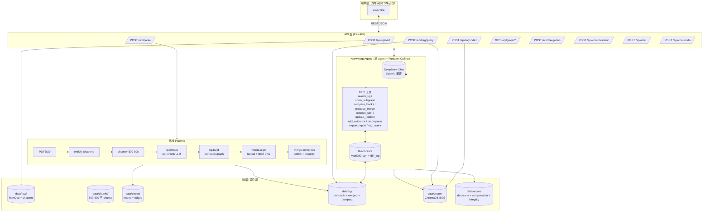
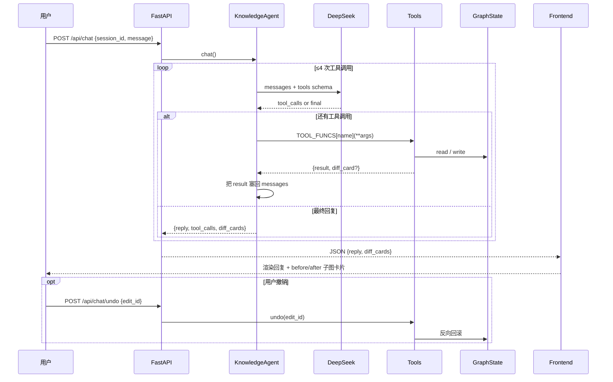
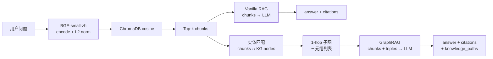

# Agent 架构说明

> 医学教材整合知识图谱 AI Agent — 单 Agent + Function Calling 架构。
> 配套代码：`src/api/`、`src/chat/`、`src/rag/`、`src/kg/`、`src/merge/`、`src/ingest/`。

## 1. 系统总览



## 2. 为什么是"单 Agent + Function Calling"

赛题要求：多轮对话迭代优化整合方案、修改图谱、Q&A 带引用。  
我们对比了 3 种方案：

| 方案 | 优点 | 缺点 | 选择 |
|---|---|---|---|
| 单 Agent + tools | 状态共享简单、调试容易、延迟可控 | 单点：复杂任务规划弱 | ✅ |
| 多 Agent (Planner/Executor/Critic) | 角色清晰、复杂任务强 | 5h 黑客松无收益、延迟翻倍、token×3 | ❌ |
| 纯 Workflow (LangGraph) | 可视化好 | 灵活性差，每加一个动作要改图 | ❌ |

→ 选 **单 Agent**：每轮对话 1~3 次 tool call 就够，延迟 < 8s。

## 3. Agent 工作循环（function-calling loop）



## 4. RAG 双模式：Vanilla vs GraphRAG



**差异化创新**：知识脉络（A -[prerequisite]-> B）注入 prompt，让回答能解释概念依赖。  
`mode=graph` (默认) 走 GraphRAG，`mode=vanilla` 走基线对照（用于 benchmark）。

## 5. 教学完整性自检（differentiator）

压缩到 30% 后，自动跑一遍 fixpoint loop：  
- 若 B 在 kept 集合，A 是 B 的 `prerequisite` 但不在 kept → 强制把 A 加回。  
- 反复迭代直至稳定，记录到 `data/report/integrity.json`。  

→ 解决"压缩后教材失去依赖前置"的硬伤。

## 6. 关键设计决策表

| # | 决策 | 理由 |
|---|---|---|
| D1 | LLM 走 OpenAI 兼容协议（DeepSeek） | 切换 ModelScope/Qwen 只需改 env var |
| D2 | 关系类型限定 4 种枚举 | 官方 schema；杜绝 LLM 自由发挥 |
| D3 | 类别限定 7 种枚举 | 同上 |
| D4 | chunker 500-800 字 + overlap | 兼顾 RAG 精度与召回 |
| D5 | 节点 ID = `{book}::node_{md5(name)[:8]}` | 同书内同名稳定，跨书可对齐 |
| D6 | 两阶段对齐：lexical → BGE 0.92 | 高准 + 高召回，alias_table 可审计 |
| D7 | 字符压缩口径（不是节点数） | 严格遵守官方 ≤30% |
| D8 | diff_card 推前端 | 老师能直观看到改动 |
| D9 | undo 通过 diff_log 反向重放 | 多轮修订安全网 |

## 7. 单本 → 整合 → 压缩 全链路示意

```mermaid
flowchart LR
    subgraph PerBook["每本教材独立"]
        A1[chunks] --> A2[extract<br/>nodes+edges]
        A2 --> A3[build<br/>per-book graph]
    end
    A3 --> M[align<br/>lexical bucket<br/>+ BGE cosine ≥0.92]
    M --> MG[merged.json<br/>+ decisions[]<br/>+ alias_table]
    MG --> C[compress<br/>score = 2*nb + log(nm) + 0.5*log(deg)]
    C --> IR[integrity rescue<br/>fixpoint]
    IR --> CG[compact.json<br/>≤ 30% 字符]
    CG --> RG[report 整合报告.md]
```
