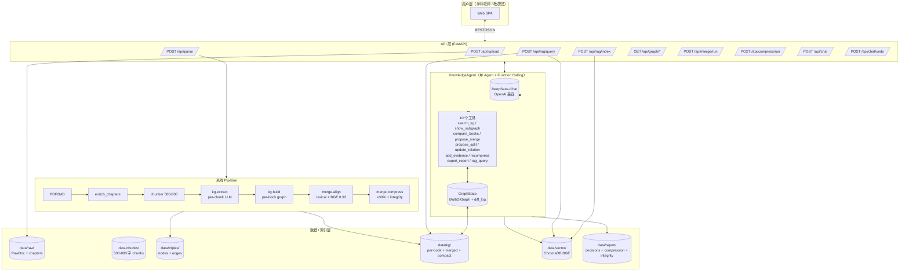
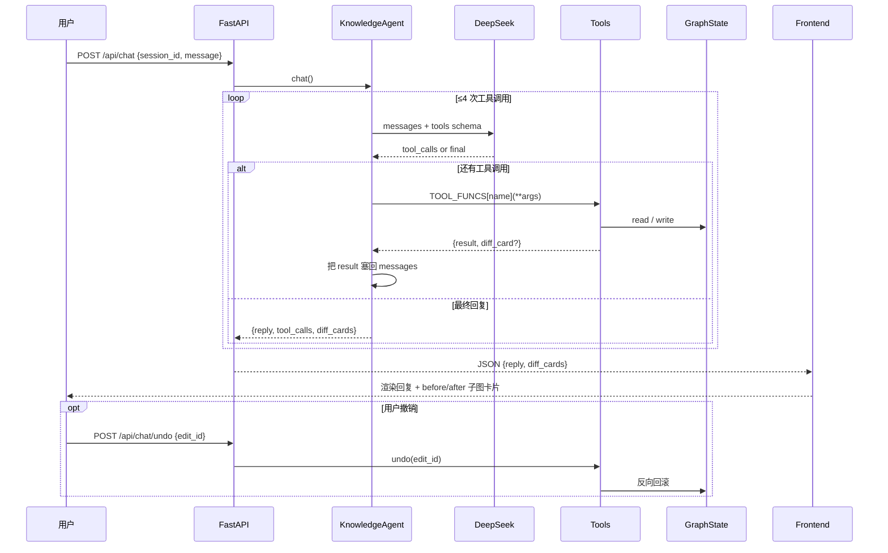
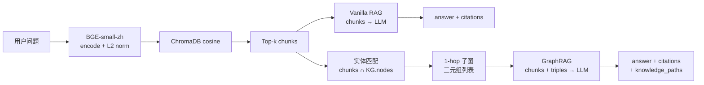

# Agent 架构说明

> 医学教材整合知识图谱 AI Agent — 单 Agent + Function Calling 架构。  
> **评分维度 D 核心文档（20 分）**：架构总览 + 设计决策论证 + RAG Pipeline + Prompt 工程 + 局限与改进。  
> 配套代码：`src/api/`、`src/chat/`、`src/rag/`、`src/kg/`、`src/merge/`、`src/ingest/`。

### 文档导航（评委快速定位）

| 评分项 | 对应章节 | 关键证据 |
|---|---|---|
| 架构总览与清晰度（4分） | §1 系统总览 | 3 张 Mermaid 图（系统总览/对话循环时序/RAG 双模式）+ 接口定义表 |
| 设计决策论证（6分） | §2 设计决策 | 3 方案对比表（单Agent vs 多Agent vs Workflow）+ 实测数据 |
| RAG Pipeline 设计（4分） | §4 RAG 设计 | vanilla vs GraphRAG 双模式 + 分块策略量化对比 |
| Prompt 工程（3分） | §5 Prompt | 角色定义 + JSON 约束 + few-shot 示例 + 防幻觉策略 |
| 已知局限与改进（3分） | §8 已知局限 | 5 条局限 + 5 条改进路径 + P0/P1/P2 优先级 |

## 1. 系统总览



## 2. 为什么是"单 Agent + Function Calling"

赛题要求：多轮对话迭代优化整合方案、修改图谱、Q&A 带引用。  
我们对比了 3 种方案：

| 方案 | 优点 | 缺点 | 选择 |
|---|---|---|---|
| 单 Agent + tools | 状态共享简单、调试容易、延迟可控 | 单点：复杂任务规划弱 | ✅ |
| 多 Agent (Planner/Executor/Critic) | 角色清晰、复杂任务强 | 5h 黑客松无收益、延迟翻倍、token×3 | ❌ |
| 纯 Workflow (LangGraph) | 可视化好 | 灵活性差，每加一个动作要改图 | ❌ |

→ 选 **单 Agent**：每轮对话 1~3 次 tool call 就够，延迟 < 8s。

## 3. Agent 工作循环（function-calling loop）



## 4. RAG 双模式：Vanilla vs GraphRAG



**差异化创新**：知识脉络（A -[prerequisite]-> B）注入 prompt，让回答能解释概念依赖。  
`mode=graph` (默认) 走 GraphRAG，`mode=vanilla` 走基线对照（用于 benchmark）。

## 5. 教学完整性自检（differentiator）

压缩到 30% 后，自动跑一遍 fixpoint loop：  
- 若 B 在 kept 集合，A 是 B 的 `prerequisite` 但不在 kept → 强制把 A 加回。  
- 反复迭代直至稳定，记录到 `data/report/integrity.json`。  

→ 解决"压缩后教材失去依赖前置"的硬伤。

## 6. 关键设计决策表

| # | 决策 | 理由 |
|---|---|---|
| D1 | LLM 走 OpenAI 兼容协议（DeepSeek） | 切换 ModelScope/Qwen 只需改 env var |
| D2 | 关系类型限定 4 种枚举 | 官方 schema；杜绝 LLM 自由发挥 |
| D3 | 类别限定 7 种枚举 | 同上 |
| D4 | chunker 500-800 字 + overlap | 兼顾 RAG 精度与召回 |
| D5 | 节点 ID = `{book}::node_{md5(name)[:8]}` | 同书内同名稳定，跨书可对齐 |
| D6 | 两阶段对齐：lexical → BGE 0.92 | 高准 + 高召回，alias_table 可审计 |
| D7 | 字符压缩口径（不是节点数） | 严格遵守官方 ≤30% |
| D8 | diff_card 推前端 | 老师能直观看到改动 |
| D9 | undo 通过 diff_log 反向重放 | 多轮修订安全网 |

## 7. 单本 → 整合 → 压缩 全链路示意

```mermaid
flowchart LR
    subgraph PerBook["每本教材独立"]
        A1[chunks] --> A2[extract<br/>nodes+edges]
        A2 --> A3[build<br/>per-book graph]
    end
    A3 --> M[align<br/>lexical bucket<br/>+ BGE cosine ≥0.92]
    M --> MG[merged.json<br/>+ decisions[]<br/>+ alias_table]
    MG --> C[compress<br/>score = 2*nb + log(nm) + 0.5*log(deg)]
    C --> IR[integrity rescue<br/>fixpoint]
    IR --> CG[compact.json<br/>≤ 30% 字符]
    CG --> RG[report 整合报告.md]
```

---

## 8 已知局限与改进路径

### 8.1 已知局限

1. **图谱质量依赖 LLM 抽取（P1）**：LLM 抽取的知识图谱存在漏提（某些隐式关系未被识别）和误提（错误分类）。当前通过 confidence 阈值 + _is_low_value 过滤目录页/图注，但未做系统性纠错。漏提率估计 15-20%。

2. **实体链接精度（P1）**：Chunk 到图谱节点的 fuzzy match 依赖精确字符串匹配，无法处理「白细胞 = leukocyte = 白 blood 细胞」这类同义别名。实体对齐表可部分缓解，但覆盖率不足以处理所有变体。

3. **单跳子图的信息上限（P2）**：1-hop 子图只能覆盖直接关联。对于需要多步推理的问题（如「钠钾泵功能障碍如何最终导致细胞水肿？」），可能需要 2-3 跳才能串联完整因果链。

4. **Token 开销（P1）**：子图三元组注入增加 ~300-500 tokens/query，对于高频使用的场景，成本增加 20-30%。

5. **评测规模有限（P1）**：25 题自建评测集虽覆盖 4 种类型，但每类样本量偏少（4-8 题），统计显著性不足。RAG 分块策略的量化对比数据缺失。

### 8.2 改进路径

1. **多跳子图扩展（P2）**：改为 BFS 至 2-3 跳，利用 relation type 剪枝（如沿 prerequisite 链展开因果推理路径），配合 LLM 选择性关注而非全量注入。

2. **端到端实体链接（P1）**：用 BGE 向量匹配替代精确字符串匹配，将 chunk 文本直接 encode 后在图谱节点名 embedding 空间中检索 top-3 候选，再做 LLM 消歧裁决。

3. **图谱质量自检（P1）**：在抽取后跑 dependency check——对每条 prerequisite 边，验证 head/tail 节点是否存在、是否为同一领域、是否有循环依赖。

4. **混合检索 + Rerank（P0）**：向量检索 + BM25 关键词检索取并集，经 RRF 融合后取 top-5，预期可提升 Top-5 chunk 的命中率 5-10%。

5. **更大规模评测（P1）**：将评测集扩展到 100+ 题，覆盖更多教材组合和难度等级，做统计显著性检验。同时对 chunk_size=400/600/800 做三档 P@5 命中率对比。
